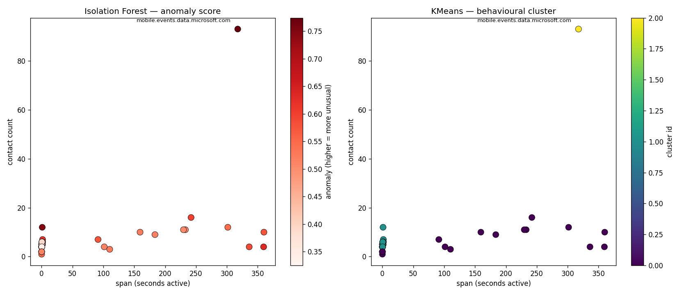

# Consent Radar

An AI-assisted privacy auditor for your own network traffic.
It answers one question: **which domains are my apps quietly talking to?**

Consent Radar listens to your device's own outbound traffic, extracts the
domains being contacted (from DNS queries and TLS SNI — no decryption of
content), flags known trackers against a public blocklist, scores each domain
for anomalous *behaviour*, and presents the result on an interactive dashboard.

---

## The headline result

In a single ~5-minute capture session on a normal work laptop, Consent Radar
recorded **449 contacts across 67 distinct domains**.

The most telling finding came from the behavioural layer, not the blocklist.
`mobile.events.data.microsoft.com` — Microsoft telemetry — was contacted **93
times** in the background with no user action, a steady heartbeat roughly every
few seconds. A public tracker blocklist does **not** flag it (first-party
telemetry is usually excluded from such lists to avoid breaking apps), so it was
labelled "other". But the anomaly detector ranked it the single most unusual
domain in the session (score **0.774**), purely from how it behaved.

That gap — a domain that phones home like a tracker but isn't on any list — is
exactly what the machine-learning layer exists to surface.

---

## How it works

A four-stage pipeline, each stage writing to a local SQLite database:

| Stage | Script | What it does |
|-------|--------|--------------|
| 1. Capture | `capture.py` | Reads domains from DNS queries and TLS SNI on your own machine (metadata only). |
| 2. Enrich | `enrich.py` | Flags each domain against a public tracker blocklist (StevenBlack hosts). |
| 3. Classify | `classify.py` | Scores each domain for anomalous behaviour with Isolation Forest; also clusters with KMeans for comparison. |
| 4. Dashboard | `dashboard.py` | Interactive Dash app showing top domains, tracker flags, and anomaly scores. |

**Honest scope note:** the tracker labelling in Stage 2 is list-based, not ML.
Only Stage 3 (the anomaly scoring) is machine learning. The project is
deliberately clear about which part does what.

---

## Results & findings

### Isolation Forest — the anomaly layer (works)

Behavioural features per domain — contact count, active time-span, contact rate,
and regularity of contact intervals — feed an Isolation Forest. The Microsoft
telemetry endpoint is isolated cleanly as the top-ranked anomaly, far from every
other point.



*(A log-scaled version, `docs/stage3_visualisation_log.png`, makes the lower
cluster readable while keeping the outlier visible.)*

### KMeans clustering — documented limitation

KMeans was run on the same features as a comparison. On this single-session
sample it separated domains largely by **how long each was observed** (their
capture time-span) rather than by privacy behaviour — an artifact of collecting
data in one short session, not a meaningful grouping. This is reported as a known
limitation: the tool leads with anomaly scoring and treats clustering as
exploratory. Being able to say *which* method worked and *why the other didn't*
is part of the point.

### Dashboard


The dashboard reads the current database state: summary counts, a bar chart of
the busiest domains, and a sortable table where flagged trackers are highlighted
and each domain shows its anomaly score.

---

## Installation

Requires **Python 3.9+** and **tshark** (the Wireshark command-line tool), which
`pyshark` wraps for packet capture.

```bash
# 1. Install tshark (macOS example)
brew install --cask wireshark      # installs tshark + ChmodBPF capture permissions

# 2. Clone and set up
git clone https://github.com/Akakiusz/Consent_Radar.git
cd Consent_Radar
python -m venv .venv
source .venv/bin/activate
pip install -r requirements.txt

# 3. Fetch a public tracker blocklist (used by the enrich stage)
mkdir -p data
curl -sL https://raw.githubusercontent.com/StevenBlack/hosts/master/hosts \
     -o data/trackers_raw.txt
```

Check your network interface name with `ifconfig` (usually `en0` on macOS) and
set `CAPTURE_INTERFACE` in `config.py` if it differs.

---

## Usage

Run the pipeline in order:

```bash
# 1. Capture live traffic (Ctrl+C to stop). May need elevated privileges.
python run.py

# 2. Flag trackers against the blocklist
python enrich.py

# 3. Score domains for anomalous behaviour
python classify.py

# 4. Launch the dashboard, then open http://127.0.0.1:8050
python dashboard.py
```

Optional: `python visualise.py` regenerates the Stage 3 comparison figures.

### Running it again

The database is **cumulative** — running the capture again adds to the existing
data rather than replacing it.

- **To build up a longer picture over time**, just run the four steps again.
  More data makes the behavioural analysis stronger (see Limitations).
- **To analyse only a fresh session**, delete the database first:

  ```bash
  rm data/captured.db
  python run.py
  python enrich.py
  python classify.py
  python dashboard.py
  ```

Re-run `enrich.py` and `classify.py` after any new capture so the tracker flags
and anomaly scores reflect the latest data before viewing the dashboard.

---

## Standalone Windows executable

Consent Radar can be packaged into a single `.exe` that runs without a Python
installation. This is handy for running it on a machine that doesn't have the
project set up.

### Requirements on the target machine

- **Wireshark** must be installed (Consent Radar uses its `tshark` component to
  capture traffic). During Wireshark setup, keep **Npcap** selected — it's the
  driver that makes packet capture work. The build locates `tshark`
  automatically in the common install paths.
- **Administrator rights** to run the capture.

The network interface is detected automatically — the app briefly probes the
available adapters and picks the one with live traffic, so there's nothing to
configure by hand.

### Building the executable

From the project root, with the dependencies installed:

```bash
pip install pyinstaller
pyinstaller --onefile --name ConsentRadar ^
    --collect-all pyshark --collect-all dash --collect-all plotly ^
    --collect-all scipy --collect-all sklearn ^
    --exclude-module sqlalchemy run.py
```

The result is `dist/ConsentRadar.exe`.

### Running it

Place the tracker blocklist next to where you run the executable (the enrich
stage reads `data/trackers_raw.txt`), then run the `.exe` from a terminal with
administrator rights. It captures traffic, labels trackers, scores domains, and
opens the dashboard at http://127.0.0.1:8050 — the same pipeline as `run.py`.

> **Note:** the executable bundles scientific libraries (scikit-learn, scipy,
> Dash), so it is large (a few hundred MB). It is not committed to this
> repository; build it locally with the command above.


## Tech stack

- **Capture:** pyshark (tshark wrapper), reading DNS + TLS SNI
- **Storage:** SQLite (standard library)
- **ML:** scikit-learn — Isolation Forest (anomaly scoring), KMeans (comparison)
- **Data:** pandas, numpy
- **Visualisation:** matplotlib (exploratory figures), Plotly + Dash (dashboard)

---

## Limitations (honest notes)

- Sees **metadata only** (domain names), never the content of traffic.
- Capture requires elevated privileges — it does not "just run" for everyone.
- DNS-over-HTTPS can hide DNS queries; in that case only TLS SNI is visible.
- Only audit **your own** traffic. Capturing others' traffic is a legal and
  ethical issue.
- Tracker labelling is list-based (public blocklist), not ML, and misses
  first-party telemetry by design.
- The anomaly and clustering results come from a **small, single-session
  sample**. They are a triage aid — "these domains are worth a look" — not a
  verdict. Longer, multi-session capture would be needed for stronger claims.

---

## Possible future work

These are honest next steps, not commitments — the project is a working
prototype, and each item below would strengthen it:

- **Longer, multi-session capture** — the current analysis rests on a single
  short session. More data would make the behavioural clustering meaningful (it
  currently splits by capture time-span, a small-sample artifact).
- **Single-command pipeline** — chain capture → enrich → classify → dashboard
  into one launcher, so it runs without four separate commands.
- **Auto-detect the network interface** — `en0` is currently hardcoded for
  macOS; detecting it would help on other setups.
- **Cross-platform testing** — capture has only been verified on macOS; Windows
  and Linux would need their own interface and permission handling.
- **Live-updating dashboard** — the dashboard currently reads a snapshot with a
  manual refresh; auto-refresh during capture would make it truly "live".
- **Richer behavioural features** — e.g. periodicity detection, to separate
  scheduled telemetry from user-driven bursts more sharply.

---

## Status

- [x] Stage 0 — project scaffold
- [x] Stage 1 — traffic capture
- [x] Stage 2 — tracker enrichment
- [x] Stage 3 — behavioural anomaly scoring + comparison visualisation
- [x] Stage 4 — interactive dashboard
- [x] Stage 5 — polish, docs & tests